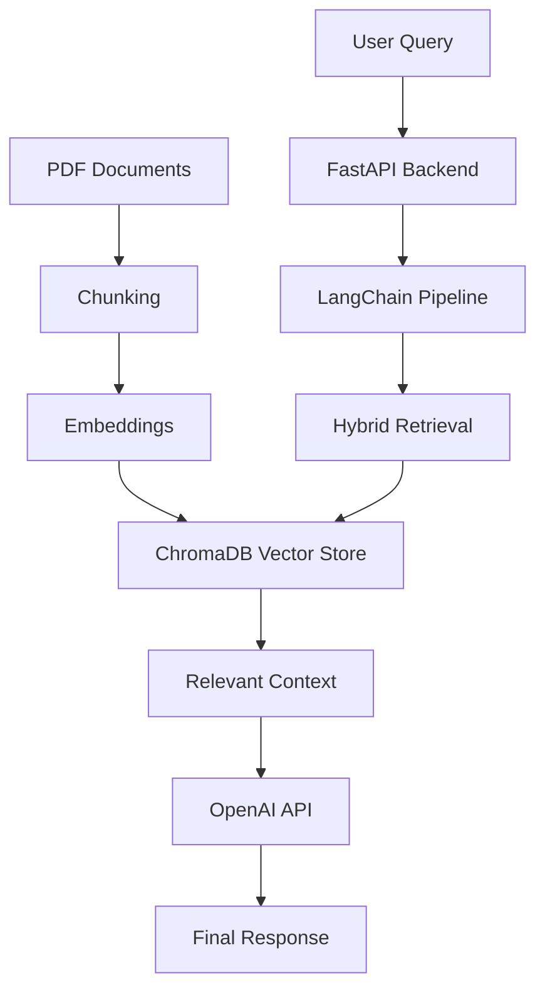

# rag-document-qa-system

Retrieval-Augmented Generation (RAG) system for document question answering using semantic search, vector retrieval, and LLM-based responses.

### Live API Documentation
https://production-rag-document-qa-system.onrender.com/docs

---

# Overview

This project demonstrates a backend-oriented AI workflow for building document intelligence systems using FastAPI, LangChain, ChromaDB, and OpenAI APIs.

Users can upload PDF documents, process document content into semantic chunks, generate embeddings, retrieve relevant context using vector similarity search, and generate grounded answers through LLM inference.

The project focuses on practical AI engineering concepts including retrieval pipelines, backend APIs, vector databases, deployment workflows, and modular system design.

---

# Key Features

- PDF document ingestion
- Semantic chunking pipeline
- Embedding generation workflow
- Vector similarity retrieval
- Context-aware answer generation
- FastAPI REST API backend
- ChromaDB integration
- Hybrid retrieval workflow
- Dockerized deployment
- Swagger/OpenAPI documentation
- Render deployment
- Modular backend structure

---

# Tech Stack

## Backend
- Python
- FastAPI
- Uvicorn

## AI / NLP
- OpenAI API
- LangChain

## Vector Database
- ChromaDB

## Deployment
- Docker
- Render

---
# Architecture



---

# API Endpoints

## Health Check

```http
GET /health
```

## Upload Document

```http
POST /upload
```

## Query Documents

```http
POST /query
```

## System Statistics

```http
GET /stats
```

---

# Example Workflow

## 1. Upload Documents

PDF documents are uploaded through the API.

## 2. Process Content

Documents are chunked into smaller semantic sections.

## 3. Generate Embeddings

Embeddings are created for semantic retrieval.

## 4. Store in ChromaDB

Chunks and embeddings are stored in the vector database.

## 5. Retrieve Relevant Context

Relevant chunks are retrieved using vector similarity search.

## 6. Generate Final Response

The LLM generates a grounded response using retrieved context.

---

# Example Questions

- Summarize this document
- What are the key concepts discussed?
- Explain the important topics
- What does the document mention about AI engineering?
- What recommendations are provided in the document?

---

# Local Development

## Clone Repository

```bash
git clone https://github.com/rajavinay-eng/rag-document-qa-system.git
```

## Install Dependencies

```bash
pip install -r requirements.txt
```

## Run FastAPI Backend

```bash
uvicorn api:app --reload
```

---

# Deployment

The application is containerized using Docker and deployed on Render.

### Deployment URL

https://production-rag-document-qa-system.onrender.com/docs

---

# Engineering Focus Areas

This project demonstrates practical experience with:

- Retrieval-Augmented Generation (RAG)
- Vector databases
- Semantic retrieval workflows
- FastAPI backend development
- AI API integration
- Dockerized deployment
- Modular backend architecture
- Context-aware LLM applications

---

# Future Improvements

- Multi-document retrieval support
- Authentication and authorization
- Conversation memory
- Advanced reranking models
- Streaming responses
- Async processing workflows
- Monitoring and observability
- Multi-user support

---

# Environment Variables

Create a `.env` file:

```env
OPENAI_API_KEY=your_api_key
```
